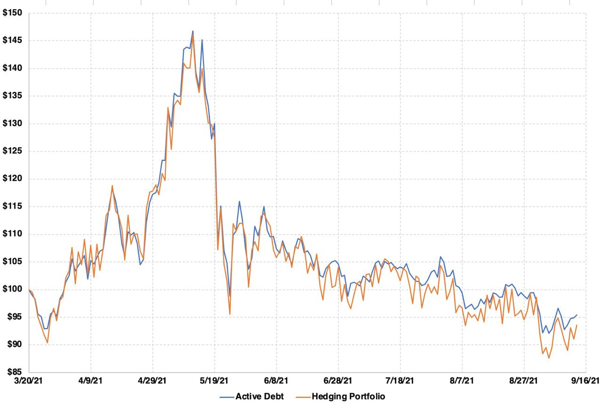

# Synthetix Debt Hedging Bot

<a href="https://heroku.com/deploy?template=https://github.com/IlyaSleptsov/Synthetix-debt-hedging-bot">
  
</a>

SNX stakers are the counterparty of all trades made through the Synthetix protocol. To avoid taking a directional risk, it is prudent to hedge debt pool exposure by taking positions that reflect the debt pool composition (e.g., when traders are net long on synths, stakers should be net long in the spot market). 

This bot mirrors the synth debt composition by taking on positions on spot markets. It uses Binance as a CEX to hedge the debt and Discord as a user interface.


   
## Required Parameters
To run this bot, it is needed to enter these parameters in the **.env** file:

- *BINANCE_API*, *BINANCE_SECRET* 
  
API key to the account from Binance exchange. Here is an instruction from Binance: [How to create API](https://www.binance.com/en/support/faq/360002502072).
  
Limitations:
1. Only Binance supported as a CEX. Open an issue if you need another one.
2. Provide an API key from the account that is dedicated to this bot. The bot won't work properly if there are other open positions. You can use [subaccounts](https://www.binance.com/en/support/faq/360020632811) on Binance if your level is VIP1 or higher.
3. For this API key enable Spot & Margin Trading and Margin Loan, Repay & Transfer but don't enable withdrawal options.

- *DISCORD_TOKEN*

Discord is an interface to use this bot. Following [this instruction](https://www.writebots.com/discord-bot-token/), create your own Discord bot to manage your portfolio and get status updates. Add this bot to your server. Don't forget to give it permission to send text messages.

Discord bot commands:
1. !run – start the bot;
2. !close – close all positions (everything will be swapped to USDT).

- *TOLERANCE* (default 5)

Tolerance is a trigger for a rebalancing initiation which indicates an acceptable % in the difference between assets.

Example:
1. Synthetix debt structure now is 30% BTC and 70% ETH.
2. Your CEX portfolio is the same: 30% BTC and% 70 ETH.
3. 5% tolerance means that rebalancing will be initiated if difference between any asset in debt and your portfolio >= 5%. In this case if Synthetix debt structure becomes 35% BTC and 65% ETH -> 35% - 30% = 5% -> 5% >= tolerance -> rebalancing is triggered. 

- *MINIMAL_THRESHOLD_BUY* (default 1%)

It defines the minimal percentage of asset in debt that will be on the buy list. 

Example: MINIMAL_THRESHOLD_BUY is 1%. Synthetix debt consists of BTC 30%, ETH 69.5% and LINK 0.5%. Bot will buy BTC 30%, ETHEREUM 69.5% and 0.5% of base asset which is Ethereum by default (0.5% LINK < 1% threshold). 

- *BASE_CURRENCY (default ETH)*

If it's impossible to buy an asset from Synthetix debt on current CEX or an asset from Synthetix debt doesn't reach a minimal threshold buy, the bot will buy base currency instead.

- *ALCHEMY_ID*
  
Provides connection to blockchain to get Synthetix debt structure. Following [this instruction](https://docs.alchemy.com/alchemy/introduction/getting-started), create your own Alchemy ID. 

- *ETHERSCAN_TOKEN*

Provides connection to blockchain to get Synthetix debt structure. Following [this instruction](https://etherscan.io/apidocs), create your own Etherscan token.


## Installation

Script requires [Node.js](https://nodejs.org/) v16+ to run.

Install the dependencies and start the server:

```sh
git clone https://github.com/IlyaSleptsov/Synthetix-debt-hedging-bot.git
cd Synthetix-debt-hedging-bot
npm i
node index.js
```
Then open your Discord server with the bot and enter !run command.


## Deploy To Heroku

1. Create [Heroku](https://heroku.com) user account
2. Click [Deploy to heroku](https://heroku.com/deploy?template=https://github.com/IlyaSleptsov/Synthetix-debt-hedging-bot) link
3. Fill the app name and click "Deploy app"
4. Choose your app in the [board list](https://dashboard.heroku.com/apps)
5. Push the "Settings" button in header and add [all required parameters](https://github.com/IlyaSleptsov/Synthetix-debt-hedging-bot#required-parameters) in "Config Vars". "KEY" is a variable name (like DISCORD_TOKEN), "VALUE" is its value.
6. Click "More" select box and choose "Restart all dynos"
7. To see script logs - select "View logs" option

## Backtesting
The critical question before launching a bot is how to be sure that it won't burn much money in the long term.

We have conducted a backtest of the bot's strategy. Here is the hedging portfolio backtesting data for nine months:



Note that there is a steady downward drift over time of the hedging portfolio relative to active debt. This is mostly from exchange fees and slippage, but this doesn't factor in exchange fees accrued by the staker, which can offset/reverse those losses over time.

In addition, the long-term trend is dependent on the TOLERANCE parameter. The lower TOLERANCE, the more transactions are done, the more fees are paid.
